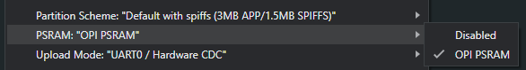

## ℹ️ 🔴 We moved this project to [Omi repository](https://github.com/BasedHardware/omi). Current repo isn't supported anymore =>
## ℹ️ 🔴 We moved this project to [Omi repository](https://github.com/BasedHardware/omi). Current repo isn't supported anymore =>
## ℹ️ 🔴 We moved this project to [Omi repository](https://github.com/BasedHardware/omi). Current repo isn't supported anymore =>

# OpenGlass - Open Source Smart Glasses

Turn any glasses into hackable smart glasses with less than $25 of off-the-shelf components. Record your life, remember people you meet, identify objects, translate text, and more.


## Video Demo

[](https://youtu.be/DsM_-c2e1ew)

## Want a Pre-built Version?

We will ship a limited number of pre-built kits. Fill out the [interest form](https://basedhardware.com/openglass) to get notified.

## Community

Join the [Based Hardware Discord](https://discord.com/invite/ZutWMTJnwA) for setup questions, contribution guide, and more.

## Getting Started

Follow these steps to set up OpenGlass:

### Hardware

1. Gather the required components:
   - [Seeed Studio XIAO ESP32 S3 Sense](https://www.amazon.com/dp/B0C69FFVHH/ref=dp_iou_view_item?ie=UTF8&psc=1)
   - [EEMB LP502030 3.7v 250mAH battery](https://www.amazon.com/EEMB-Battery-Rechargeable-Lithium-Connector/dp/B08VRZTHDL)
   - [3D printed glasses mount case](https://storage.googleapis.com/scott-misc/openglass_case.stl)

2. 3D print the glasses mount case using the provided STL file.

3. Open the [firmware folder](https://github.com/BasedHardware/openglass/tree/main/firmware) and open the `.ino` file in the Arduino IDE.
   - If you don't have the Arduino IDE installed, download and install it from the [official website](https://www.arduino.cc/en/software).
   - Alternatively, follow the steps in the [firmware readme](firmware/readme.md) to build using `arduino-cli`

4. Follow the software preparation steps to set up the Arduino IDE for the XIAO ESP32S3 board:
   - Add ESP32 board package to your Arduino IDE:
     - Navigate to File > Preferences, and fill "Additional Boards Manager URLs" with the URL: `https://raw.githubusercontent.com/espressif/arduino-esp32/gh-pages/package_esp32_index.json`
     - Navigate to Tools > Board > Boards Manager..., type the keyword `esp32` in the search box, select the latest version of `esp32`, and install it.
   - Select your board and port:
     - On top of the Arduino IDE, select the port (likely to be COM3 or higher).
     - Search for `xiao` in the development board on the left and select `XIAO_ESP32S3`.

5. Before you flash go to the "Tools" drop down in the Arduino IDE and make sure you set "PSRAM:" to be "PSRAM: "OPI PSRAM"



6. Upload the firmware to the XIAO ESP32S3 board.

### Software

1. Clone the OpenGlass repository and install the dependencies:
   ```
   git clone https://github.com/BasedHardware/openglass.git
   cd openglass
   npm install
   ```
   You can also use **yarn** to install, by doing
   ```
   yarn install
   ```

3. Configure server-side environment variables (never committed to the repo, never exposed to the browser). Copy `.env.template` and fill in:
   - `VISION_API_KEY` — Groq API key
   - `VISION_BASE_URL` — `https://api.groq.com/openai/v1`
   - `VISION_MODEL` — `llama-3.2-11b-vision-preview`
   - `CHAT_API_KEY` — NVIDIA NIM API key
   - `CHAT_BASE_URL` — `https://integrate.api.nvidia.com/v1`
   - `CHAT_MODEL` — `meta/llama-3.2-90b-vision-instruct`
   - `EXPO_PUBLIC_SUPABASE_URL` and `EXPO_PUBLIC_SUPABASE_ANON_KEY` — Supabase project URL and anon key (these are the only values meant to be public and ship in the client bundle).

   Provider keys (`VISION_API_KEY` / `CHAT_API_KEY`) are read only inside the Vercel serverless functions under `api/` and are never bundled to the client. Do not put them in `sources/keys.ts` or any `EXPO_PUBLIC_*` variable.

4. Start the application:
   ```
   npm start
   ```

   If using **yarn** start the application with
   ```
   yarn start
   ```

   Note: This is an Expo project. For now, open the localhost link (this will appear after completing step 5) to access the web version.

## License

This project is licensed under the MIT License.

## [ℹ️ 🔴 We moved this project to Omi repository. Current repo isn't supported anymore =>](https://github.com/BasedHardware/Omi)
